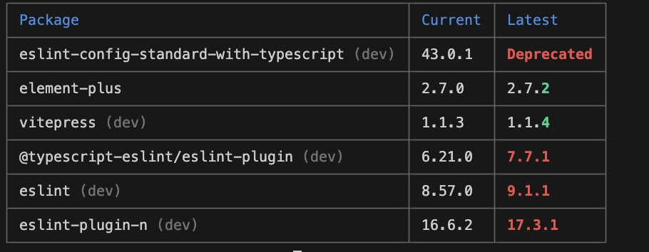

<!-- ---
title: VitePress
--- -->

# PNPM

<pre>{{ theme }}</pre>

### Page Data

<pre>{{ page }}</pre>

### Page Frontmatter

<pre>{{ frontmatter }}</pre>

## 概述

使用 pnpm 时，依赖会被存储在内容可寻址的存储中。不用重复安装

## 安装

```
npm i -g pnpm
```

## 配置

```
npm config list

pnpm config list
pnpm config get <key>
pnpm config set <key>
pnpm config delete <key>
```

## 过滤

执行 packages 下的 lxy-image-preview 的脚本

```
pnpm -F lxy-image-preview build
```

执行 packages 下除了 lxy-image-preview 的脚本

```
pnpm -F='!lxy-image-preview' build
```

## 管理依赖

### 安装：pnpm add

```
pnpm add <pkg>	//保存到 dependencies
pnpm add <pkg> -D	//保存到 devDependencies
pnpm add <pkg> -O	//保存到 optionalDependencies
pnpm add <pkg> -g	//安装到全局
pnpm add <pkg> -w	//安装到根项目（即使是在子目录下执行，也同样会安装到根项目）
pnpm add <pkg>@next	//从 next 标签下安装
pnpm add <pkg>@latest	//从 latest 标签下安装
pnpm add <pkg>@3.0.0	//安装指定版本 3.0.0

```

### 全局设置

```
pnpm config set ignore-workspace-root-check true
```

### 安装：pnpm install

等同于pnpm i，用于安装项目所有依赖

### 删除：pnpm remove

别名：rm、uninstall、un 从 node_modules 和项目的 package.json 中删除相关 packages。

### 连接：pnpm link

别名：ln

```
pnpm link <dir>
pnpm link --global
pnpm link --global <pkg>
```

### 取消连接：pnpm unlink

取消链接一个系统范围的package (相对于 pnpm link).

### 重建：pnpm rebuild

别名：rb 重建一个package。

### 修剪：pnpm prune

移除不需要的packages

### 修改全局包目录

执行下面命令，之后所有的依赖包会保存到指定目录中

```
pnpm config set store-dir D:\Node\Cache\pnpm\store
```

## 查看依赖

### 检查：pnpm audit

实际在使用这个命令时，淘宝镜像（https://registry.npmmirror.com/） 是不支持检查的


### 打印依赖：pnpm list

别名：ls 此命令会以一个树形结构输出所有的已安装package的版本及其依赖。

```
pnpm ls
pnpm ls -r	//递归打印工作区依赖
pnpm ls --depth=0 -r
pnpm ls -g --depth=0
```

### 打印过期依赖：pnpm outdated

可以检查package.json中所有依赖包当前版本和最新版本。 

### 打印指定包的依赖：pnpm why

`没有验证`

```
pnpm why
```

## 运行脚本

### 运行：pnpm run

假如您有个 watch 脚本配置在了package.json 中，像这样：

```
"scripts": {
    "watch": "webpack --watch",
    "watch1": "webpack --watch",
    "watch3": "webpack --watch",
}
```

执行pnpm run watch。也可以用正则去匹配执行多个脚本，下面的命令会匹配所有watch开头的命令。

```
pnpm run "/^watch:.*/"
```

### 执行：pnpm exec

在项目范围内执行 shell 命令。例如，项目目录下node_modules/.bin目录下有个max脚本文件。直接执行max -v是无效的，但是可以通过pnpm exec max -v来执行这个命令。pnpm exec [命令名] 类似于 npx [命令名]

### 创建项目：pnpm create

这两个命令都可以用来创建项目，例如创建一个项目：

```
pnpm create vite ./my-app
```

## 管理Node版本

配置命令

```
pnpm env <cmd>

//cmd：
//use：使用
//remove：删除
//list：打印全部
```

```
pnpm env use -g lts	//安装LTS 版本
pnpm env use -g 16	//安装 v16：
pnpm env use -g latest	//最新版本
```

## 缓存目录

### 查看全局变量的地址

```
npm config get prefix
```

### 修改pnpm缓存地址

```
pnpm config set store-dir [目录]
pnpm store path #查看store目录
```

### 从存储中删除未引用的包。

```
pnpm store prune
```
