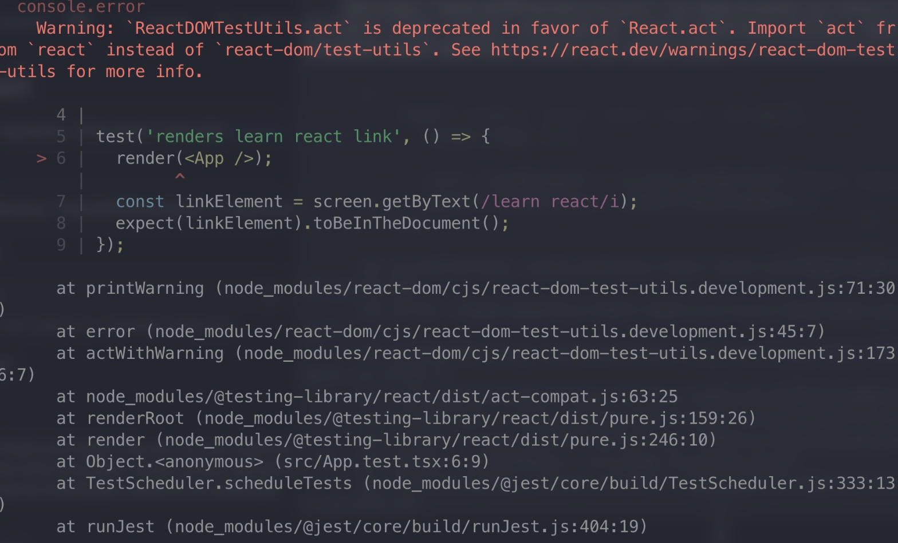
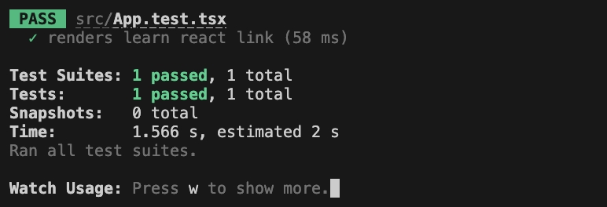

# react 组件单测

## 安装

```
npx create-react-app react-unit-test-study --template typescript
pnpm test
```

 不巧的是,警告了。没关系更新`package.json`

```package.json
"@testing-library/react": "^15.0.6",
```

可以看到测试内容很少。大致可以这么解释

1. 引入文件
2. 创建一条测试
3. 渲染app
4. `screen`根据文本不区分大小写查找文本内容learn react的组件
5. 预料这个组件在文档中 

## 写第一个测试用例

### 安装组件库

```bash
pnpm add antd
```

```app.ts
import "./App.css";
import { Button, message } from "antd";
import { useCallback } from "react";

function App() {
  const showMessage = useCallback(() => {
    message.info(`展示一个提示`);
  }, []);

  return (
    <div className="App">
      <Button type="primary" onClick={showMessage}>
        按钮
      </Button>
    </div>
  );
}

export default App;
```

```App.test.tsx
test('renders learn react link', () => {
  render(<App />);
  const linkElement = screen.getByText("按 钮");
  expect(linkElement).toBeInTheDocument();
});
```


