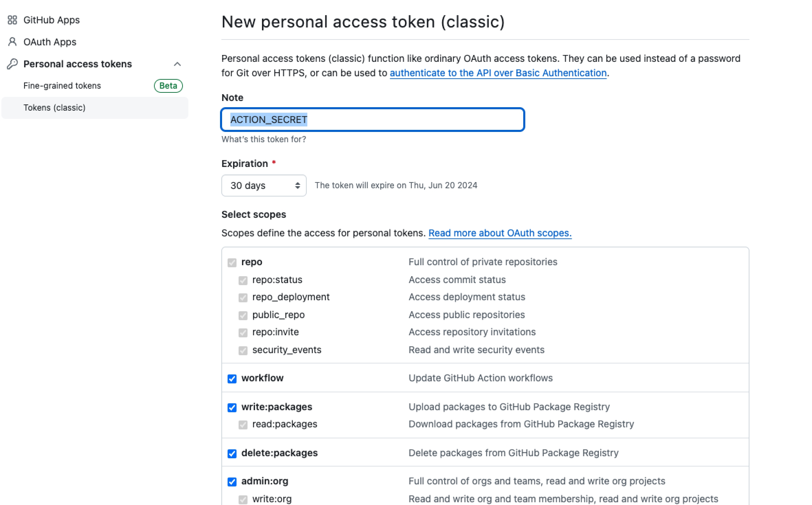
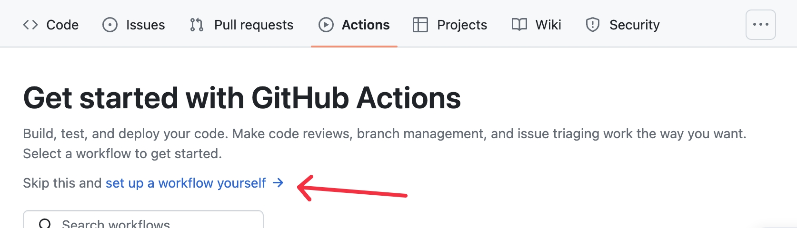
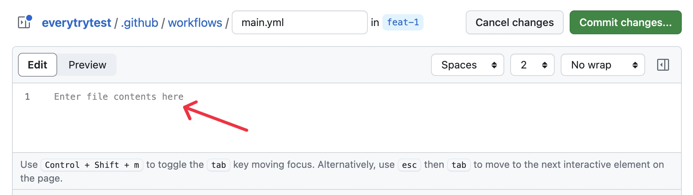

# git Actions

你可以理解他是一个虚拟机，可以帮你实现仓库的部署。他可以安装软件，执行脚本。

## 首先需要申请一个token,打开github的设置


## 创建一个token


## 输入一个名字，然后是过期天数,这里需要对`workflow`打勾,名字推荐用大写。如：ACTION_SECRET



## 创建成功，你就可以使用

 准备工作已经做好了

## 创建Actions



## 编辑main.yml,就可以实现指令



## 指令详情

先看一段yml

```
name: docs-deploy # 流程名称

on: # 触发条件
  # 每当 push 到 master 分支时触发部署
  push:
    branches: [master]
jobs: # 工作
  docs: # 工作名称
    runs-on: ubuntu-latest # 指定运行所需要的虚拟机环境（必填）
    steps:
      - uses: actions/checkout@v2
        with:
          # “最近更新时间” 等 git 日志相关信息，需要拉取全部提交记录
          fetch-depth: 0
      - name: Install pnpm
        uses: pnpm/action-setup@v2
        with:
          version: 7
      - name: Setup Node.js
        uses: actions/setup-node@v2
        with:
          # 选择要使用的 node 版本
          node-version: '16'
          cache: 'pnpm'
        # 如果缓存没有命中，安装依赖
      - name: Install dependencies
        run: pnpm install --no-frozen-lockfile --ignore-scripts
      # 运行构建脚本
      - name: Build vitepress site
        run: pnpm docs:build
        env:
          DOC_ENV: preview
          NODE_OPTIONS: --max-old-space-size=4096
      # 查看 workflow 的文档来获取更多信息
      # @see https://github.com/crazy-max/ghaction-github-pages
      - name: Deploy to GitHub Pages
        uses: crazy-max/ghaction-github-pages@v2
        # 环境变量
        env:
          GITHUB_TOKEN: ${{ secrets.ACTION_SECRET }} ## 这里用到了token的变量
        with:
          # 部署到 gh-pages 分支
          target_branch: gh-pages
          # 部署目录为 vitepress 的默认输出目录
          build_dir: docs/.vitepress/dist

```

## 自定义何时触发工作流运行

### 将工作流设置为在向主分支和发布分支推送事件时运行

```
on:
  push:
    branches:
    - main
    - release/*
  pull_request:
    branches:
    - main
```

### 日程-定时任务

```
on:
  schedule:
  - cron: "0 2 * * 1-5"
```

### 手动运行工作流

```
on:
  workflow_dispatch:
```

## 在不同的操作系统上运行作业

```
jobs:
  my_job:
    name: deploy to staging
    runs-on: ubuntu-22.04
```

可用的虚拟机类型

- ubuntu-latest, ubuntu-22.04, or ubuntu-20.04
- windows-latest, windows-2022, or windows-2019
- macos-latest, macos-13, or macos-12

## 使用一个动作

```
- name: Setup Node
  uses: actions/setup-node@v4
  with:
    node-version: '20.x'
```

### Marketplace `action市场`

你可以在这里寻找你想要的action[链接](https://github.com/marketplace?query=setup-node)

## 执行一个命令

```
- name: Install Dependencies
  run: npm install
```

## 有条件地运行步骤或作业

```
steps:
- run: npm publish
  if: github.event_name == 'push'
```
