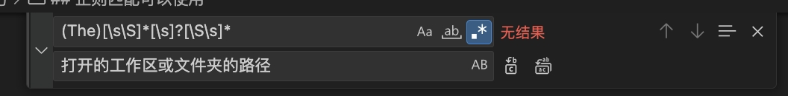

# VsCode 技巧

## Snippets

| 变量 | 含义 |
|:--|--:|
|TM_SELECTED_TEXT | 当前选择的文本或空字符串
|TM_CURRENT_LINE | 当前行的内容
|TM_CURRENT_WORD | 光标下单词的内容或空字符串
|TM_LINE_INDEX | 基于零索引的行号
|TM_LINE_NUMBER |基于一个索引的行号
|TM_FILENAME |当前文档的文件名
|TM_FILENAME_BASE |不带扩展名的当前文档的文件名
|TM_DIRECTORY |当前文档的目录
|TM_FILEPATH |当前文档的完整文件路径｜
|RELATIVE_FILEPATH |当前文档的相对（相对于打开的工作区或文件夹）文件路径
|CLIPBOARD |剪贴板的内容｜
|WORKSPACE_NAME| 打开的工作区或文件夹的名称｜
|WORKSPACE_FOLDER |打开的工作区或文件夹的路径
|CURSOR_INDEX |基于零索引的光标编号｜
|CURSOR_NUMBER |基于一个索引的光标编号｜

## 正则匹配
可以使用vscode功能来测试正则匹配
